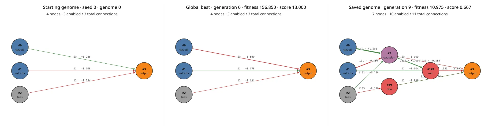
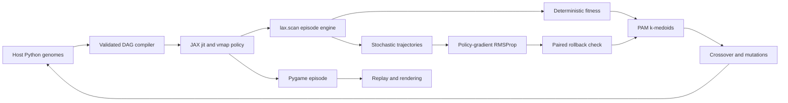

# JAX NEAT Flappy Bird

This project trains an acyclic neural network to play Flappy Bird. It combines
NEAT-style graph evolution with policy-gradient updates in JAX. It uses the game
mechanics and image assets from
[`techwithtim/NEAT-Flappy-Bird`](https://github.com/techwithtim/NEAT-Flappy-Bird)
at commit `a9ffef157866a487dbb762dfa1775ac7d21c9faf`.

The implementation does not use `neat-python`, Graphviz, or Matplotlib. It owns
the genome format, innovation records, crossover, mutations, clustering,
feed-forward compiler, optimizer, checkpoints, and SVG graph renderer.

## Training result

The default seed-0 run completed generations `0..9`. A three-connection linear
policy already reached the 1,000-frame episode cap in generation 0. The
complexity penalty kept that minimal policy as the global champion while the
population mean improved.

| Generation | Global best fitness | Candidate mean fitness | Pipe score | Alive frames |
| ---: | ---: | ---: | ---: | ---: |
| 0 | 156.850 | 4.993 | 13.000 | 1,000 |
| 5 | 156.850 | 31.823 | 13.000 | 1,000 |
| 8 | 156.850 | 81.293 | 13.000 | 1,000 |
| 9 | 156.850 | 101.944 | 13.000 | 1,000 |

Fitness includes the connection-count penalty. Pipe score and alive frames do
not. Each value uses three deterministic evaluation episodes. A replay with
another seed can have a different score.



The left graph is genome 0 before evaluation or backpropagation. The center
graph is the global champion, discovered in generation 0. The right graph is
the most structurally complex retained offspring from generation 9. It has
four hidden nodes with `square`, `multiply`, `add`, and `add` operators. This sample
shows that feed-forward topology mutation is active even though the simpler
generation-0 policy remains the global champion. Green edges have positive
weights. Red edges have negative weights. Dashed gray edges are disabled.

## Replay progression

These animations use replay seed 0 and the same game state machine:

<table>
  <tr>
    <th>Original genome</th>
    <th>Generation 2 offspring</th>
    <th>Global champion</th>
  </tr>
  <tr>
    <td></td>
    <td></td>
    <td></td>
  </tr>
  <tr>
    <td>Genome 0 before evaluation or backpropagation</td>
    <td>Generation 2 offspring: saved fitness 9.411, mean score 0</td>
    <td>Global champion: saved fitness 156.850, mean score 13</td>
  </tr>
</table>

The middle replay uses the retained offspring closest to the generation 2
retained-offspring mean. The final champion reached the 1,000-frame evaluation
cap. It was discovered in generation 0 and remained the best after nine
generations. A larger network cannot beat its capped raw return after the
connection penalty.

## Long-horizon comparison

The normal training evaluation stops after 1,000 frames. A separate deterministic
comparison ran the global champion, the best retained generation 9 offspring,
and the generation 9 topology sample for up to 100,000 frames or 1,000 in-game
points. Each pair used the same pipe sequence.

| Seed | Genome | Points | Frames | Termination |
| ---: | --- | ---: | ---: | --- |
| 0 | Global best | 1,000 | 75,020 | Score cap |
| 0 | Generation 9 best offspring | 1,000 | 75,020 | Score cap |
| 0 | Generation 9 topology sample | 0 | 82 | Death |
| 9,000 | Global best | 1,000 | 75,020 | Score cap |
| 9,000 | Generation 9 best offspring | 1,000 | 75,020 | Score cap |
| 9,000 | Generation 9 topology sample | 0 | 81 | Death |
| 9,001 | Global best | 1,000 | 75,020 | Score cap |
| 9,001 | Generation 9 best offspring | 1,000 | 75,020 | Score cap |
| 9,001 | Generation 9 topology sample | 0 | 81 | Death |
| 9,002 | Global best | 1,000 | 75,020 | Score cap |
| 9,002 | Generation 9 best offspring | 1,000 | 75,020 | Score cap |
| 9,002 | Generation 9 topology sample | 0 | 81 | Death |

The global champion and the generation 9 best offspring reach the 1,000-point
cap in exactly 75,020 frames on all four seeds. Both are minimal
three-connection policies with the same weights. The generation 9 topology
sample, an eight-node network with fifteen connections selected for structural
complexity, dies within 82 frames on every seed. Its saved fitness (6.361)
reflects the untrained complex network: four policy-gradient cycles per
generation are not enough to converge a random high-connection topology, and
the connection penalty keeps its fitness far below the champion's 156.850.

Reproduce either pair with:

```sh
SDL_VIDEODRIVER=dummy uv run python tools/compare_genomes.py \
  --best checkpoints/best_genome.json \
  --candidate checkpoints/generation_009.json \
  --candidate-label generation-9-best-offspring \
  --seeds 0 9000 9001 9002 \
  --max-score 1000 \
  --max-frames 100000
```

Use `checkpoints/topology_009.json` as `--candidate` to compare the plotted
topology sample. The score cap is an actual episode termination condition, not
a post-processing truncation.

## System overview



Host Python owns discrete graph topology, evolution, random topology choices,
and episode scheduling. JAX owns numeric inference, action sampling, loss
evaluation, gradients, and RMSProp weight updates. Training runs each
population episode as one compiled `jax.lax.scan` over frames with `vmap`
over birds. Replay and rendering keep the Pygame state machine.

## Game state and policy

Each bird receives two normalized `float32` values:

```math
o_t =
\left[
\frac{(h_t+b_t)/2-y_t}{800},
\frac{\Delta y_t}{16}
\right]
```

where:

- $y_t$ is the bird height.
- $(h_t+b_t)/2$ is the center of the next pipe gap.
- $\Delta y_t$ is the displacement from the preceding physics step.

The two values tell the policy where the gap is and how the bird is moving.
The network returns one unactivated logit $z_t$. The policy probability is:

```math
\pi(a_t=1\mid o_t)=\sigma(z_t)
```

Action `1` makes the bird jump. Deterministic evaluation and replay jump when
$z_t>0$, which is equivalent to $\sigma(z_t)>0.5$. Policy-gradient episodes
sample the action from the Bernoulli distribution.

Training uses a pure-JAX vectorized engine. Replay and rendering use the
original Pygame state machine. Both engines share the same constants and the
same seeded pipe schedule:

- Window size: 600 by 800.
- Floor height: 730.
- Pipe gap: 200 pixels.
- Pipe and floor speed: 5 pixels per frame.
- Bird jump velocity: `-10.5`.
- One seeded pipe sequence shared by all birds in a candidate batch.
- Original bird tilt and animation sequence (Pygame engine only).

The engines differ only in collision testing. The Pygame engine uses
pixel-perfect sprite masks and rounds the bird height to an integer pixel.
The training engine uses axis-aligned bounding boxes against the bird image
rectangle of 68 by 48 pixels. The box test is slightly more conservative, so
a genome trained with the vectorized engine can replay marginally differently
under Pygame.

The frame reward order is:

1. Give each live bird `+0.1`.
2. Move each bird.
3. Create the observation and apply the action.
4. Move the floor and pipes.
5. Give `-1.0` for a pipe collision.
6. Give `+5.0` to survivors when they pass a pipe.
7. Remove floor and upper-bound deaths without another penalty.

A terminal frame keeps rewards that occurred before the terminal removal.

The vectorized training engine applies the same reward components in the same
order inside each scan step.

## Starting genome

Generation 0 contains 100 mutable genomes by default. All genomes start with
the same topology:

| Node ID | Kind | Meaning |
| ---: | --- | --- |
| 0 | Input | Signed distance from bird to pipe-gap center |
| 1 | Input | Vertical bird displacement |
| 2 | Bias | Constant `1.0` |
| 3 | Output | Bernoulli action logit |

Connections `0..2` connect both inputs and the bias directly to output node 3.
There are no hidden nodes. Each initial weight is:

```math
w \sim \mathcal{N}(0,0.25^2) + \mathcal{N}(0,0.005^2)
```

The second term is the Hardmaru constructor mutation burst. The output is a
linear weighted sum. The sigmoid is applied only at the policy boundary.

## Node operators

A hidden node uses one uniformly sampled operator:

| Operator | Result |
| --- | --- |
| `sigmoid` | $\sigma(s)$ |
| `tanh` | $\tanh(s)$ |
| `relu` | $\max(0,s)$ |
| `gaussian` | $\exp(-s^2)$ |
| `sin` | $\sin(s)$ |
| `abs` | $\lvert s\rvert$ |
| `multiply` | Product of weighted inputs |
| `square` | $s^2$ |
| `add` | $s$ |

For normal unary nodes, $s=\sum_i w_i x_i$. An `add` node uses the same sum
without another activation. A `multiply` node uses
$\prod_i (w_i x_i)$. The zero-input identity is `0.0` for sum operators and
`1.0` for `multiply`.

## Innovation records and graph safety

The process-owned `InnovationStore` keeps:

- Append-only node records.
- Append-only connection innovation records.
- One endpoint-to-innovation index for `(source, destination)`.

Node IDs and innovation IDs are stable. The code does not compress or renumber
them. A genome owns a set of node IDs and a map of connection genes. Each
connection stores its innovation ID, source, destination, weight, and enabled
state.

Every constructed or loaded genome is validated. A connection cannot:

- Leave the output node.
- Target an input or bias node.
- Connect a node to itself.
- Refer to an unknown endpoint or innovation.
- Close a directed cycle.

The JAX compiler also checks the graph before it creates a program.

## Mutations

Every child applies mutation operations in this order:

1. Try to add a node with probability `0.2`.
2. Try to add a connection with probability `0.5`.
3. Mutate each connection weight independently with probability `0.9`.

### Add-node mutation

The mutation samples one connection gene. If it is disabled, the attempt ends.
Otherwise, it transforms:

```math
u \xrightarrow{w} v
```

It disables that connection and inserts a fresh hidden node $n$:

```math
u \xrightarrow{1.0} n \xrightarrow{w} v
```

The new hidden operator is sampled uniformly from the nine-operator palette.
Repeated splits always receive fresh node IDs. Split nodes are not reused
between genomes.

### Add-connection mutation

The mutation samples one source and one target. The source can be an input,
bias, or hidden node. The target can be a hidden or output node. The attempt
ends if it selects a self-link, an enabled duplicate, or a cycle-producing
endpoint. It does not search for a different valid pair.

If the local endpoint is disabled, the mutation enables it and samples a fresh
weight from $\mathcal{N}(0,0.25^2)$. If another genome created the endpoint
first, the mutation reuses its global innovation ID.

### Weight mutation

Each selected weight receives:

```math
w \leftarrow w + \epsilon,\qquad
\epsilon\sim\mathcal{N}(0,0.005^2)
```

The implementation does not delete nodes or connections.

## Crossover

Crossover aligns parent connection genes by innovation ID.

- A matching gene is selected from either parent with equal probability.
- A unilateral gene is copied from the parent that owns it.
- A matching gene is disabled only when both parent genes are disabled.
- Every base node and every node referenced by an inherited gene is included.
- Enabled genes are inserted in innovation order.
- A gene that would close a cycle is retained but disabled.

This is the selected Hardmaru-style reproduction rule. It does not discard
unilateral genes based on parent fitness.

## Compatibility and clusters

The population uses five PAM k-medoids clusters. Compatibility distance is:

```math
d =
10\frac{E}{N}
+10\frac{D}{N}
+0.1\overline{\Delta w}
```

where:

- $E$ is the number of excess connection genes.
- $D$ is the number of disjoint connection genes.
- $N=\max(|V_1|,|V_2|,1)$.
- $\overline{\Delta w}$ is the mean absolute weight difference for matching
  genes that are enabled in both genomes.

Gene presence, not enablement, determines excess and disjoint counts.

PAM starts with five distinct medoids. It tests medoid swaps in stable genome-ID
order. It accepts the first swap that strictly decreases total distance. It
stops after a complete pass without an accepted swap or after 100 passes.
Fitness ties use the lower genome ID.

## Parent selection, archives, and extinction

Each cluster creates `population_size / 5` children. Positive Flappy Bird
reward replaces Hardmaru's negative regression error. Parent roulette therefore
uses inverse regret from the best member in that cluster:

```math
p_i \propto \frac{1}{\max(f_{\text{cluster}})-f_i+0.01}
```

No mutable parent is copied directly to the next mutable population.

Historical protection uses up to:

- Five all-time hall-of-fame copies.
- One current champion copy from each of the five clusters.

Generation 0 evaluates 100 mutable genomes. Each later generation starts with
100 new mutable children, removes duplicate elite genomes, inserts the unique
elites, and uniformly removes the same number of children. The evaluated
population therefore remains exactly 100 candidates. Injected elites receive
fresh IDs and are re-evaluated on the common benchmark seeds.

Once per generation, extinction is sampled with probability `0.5`. Cluster
quality is the fitness of its best member, as in Hardmaru's implementation. If
extinction occurs, all children allocated to the worst cluster use parents from
the best cluster. Other clusters use their own parents.

## Fitness and complexity penalty

Let $R$ be the mean game return and $C$ be the total number of connection
genes, including disabled genes. The Hardmaru connection factor is:

```math
q(C)=1+0.03\sqrt{C}
```

Hardmaru multiplies negative regression fitness by this factor. Flappy Bird
maximizes a signed reward, so this implementation uses:

```math
f(R,C)=
\begin{cases}
R/q(C), & R\geq0\\
R\,q(C), & R<0
\end{cases}
```

Extra connections therefore reduce fitness for both positive and negative
returns. If two genomes have the same game return, the simpler genome wins.
The logs and checkpoints store this adjusted fitness. Pipe score and alive
frames remain unpenalized.

This architecture penalty is separate from the `0.001` weight-magnitude
regularization in the RMSProp update.

## Deliberate differences from Hardmaru

The evolution constants and operations follow
[`hardmaru/backprop-neat-js`](https://github.com/hardmaru/backprop-neat-js):
five clusters, a `0.5` extinction probability, `0.2` add-node attempts, `0.5`
add-connection attempts, `0.9` per-gene weight mutation, `0.005` mutation
standard deviation, innovation-aligned crossover, and the connection penalty
above.

The task requires these differences:

- The graph is a feed-forward DAG. Hardmaru permits recurrent links.
- The policy has two Flappy Bird state inputs instead of two classifier
  coordinates.
- REINFORCE replaces supervised logistic-regression gradients because the game
  has rewards, not labels.
- Inverse regret replaces inverse error for parent roulette because game
  fitness is maximized.
- Backpropagation uses seeded trajectories and paired rollback evaluation
  instead of repeatedly scanning a fixed labeled data set.


## Feed-forward compilation in JAX

The phenotype compiler keeps only nodes and enabled edges that can reach output
node 3. It creates:

- A dense node-ID-to-slot map.
- Static source and destination arrays.
- Static activation codes.
- A validated topological schedule.
- An enabled-weight vector ordered by innovation ID.

The structural signature is:

```text
(ordered node IDs and activation codes,
 ordered enabled innovation/source/destination triples)
```

Genomes with the same signature share compiled functions. Numeric weight
changes do not cause recompilation.

The hot numeric paths use:

- `jax.jit` for inference, action sampling, policy loss, gradients, and RMSProp.
- `jax.vmap` for genomes with matching graph signatures.
- `jax.lax.scan` over frames with `vmap` over birds, so one compiled program
  per topology runs a whole population episode.
- Static population-width batches and a fixed `max_frames` scan length to
  prevent recompilation for different live-bird counts or episode lengths.
- `jax.lax.switch` for hidden-node operators.

Only the enabled weight vector is differentiated. Topology, innovation IDs,
actions, masks, and game transitions stay outside automatic differentiation.

### Packed edge vector versus dense `wMat`

BackpropNEAT stores enabled weights in a dense node-by-node matrix. NEATBird
packs the same enabled weights into an innovation-ordered vector. For enabled
edge `k`, the representations map as:

```math
w_k = W_{\mathrm{pos}(\mathrm{src}_k),
          \mathrm{pos}(\mathrm{dst}_k)}
```

| Property | Packed vector | Dense `wMat` |
| --- | --- | --- |
| Parameter shape | `(E,)` | `(N, N)` |
| Weight and optimizer storage | `O(E)` | `O(N^2)` |
| Non-edge entries | Not allocated | Stored as zero |
| Edge lookup | Innovation-to-vector slot | Source/destination positions |
| Automatic differentiation | Enabled reachable edges | Matrix entries read by enabled edges |
| Topology and activations | Static compiled schedule | Static compiled schedule |

This is not an expressiveness difference. Both forms retain every enabled edge,
activation, gradient, and weight writeback. A dense matrix gives a direct
adjacency view and can help dense homogeneous networks use matrix operations.
NEAT graphs are sparse and use heterogeneous operators such as `multiply`, so
the forward pass still follows a topological per-node schedule. The packed
vector avoids dense zero parameters without changing the phenotype.

## Policy-gradient loss

For reward $r_t$, discounted reward-to-go is:

```math
G_t=\sum_{k=t}^{T-1}0.99^{k-t}r_k
```

The valid $G_t$ values are centered. They are also divided by their standard
deviation when it is greater than $10^{-8}$. The result is advantage $A_t$.

For action $a_t\in\{0,1\}$ and logit $z_t$, the implementation computes the
Bernoulli log-probability with `softplus`:

```math
\log \pi(a_t\mid z_t)=
-a_t\,\mathrm{softplus}(-z_t)
-(1-a_t)\,\mathrm{softplus}(z_t)
```

The masked loss is:

```math
\mathcal{L}=
-\frac{\sum_t m_t\,\mathrm{stopgrad}(A_t)
\log\pi(a_t\mid z_t)}{\sum_t m_t}
-0.01\frac{\sum_t m_t\,H(\pi_t)}{\sum_t m_t}
```

The entropy term keeps the Bernoulli policy exploratory. Each generation uses
four stochastic policy-gradient cycles by default.

## RMSProp update

The raw gradient is clipped elementwise:

```math
g\leftarrow\mathrm{clip}(g,-5,5)
```

The uncentered RMSProp cache is:

```math
v\leftarrow0.999v+0.001g^2
```

The weight update is:

```math
w\leftarrow
\mathrm{clip}\left(
w-0.01\frac{g}{\sqrt{\max(v,10^{-8})}}-0.001w,
-50,50
\right)
```

The final `-0.001w` term is decoupled regularization. It is applied after the
normalized gradient term.

## Paired rollback check

Backpropagation must not reduce fixed-seed complexity-adjusted fitness.

1. Score every candidate on three common deterministic seeds.
2. Save its weights and RMSProp cache.
3. Run the policy-gradient cycles.
4. Score it again on the same seeds.
5. Restore its saved weights and cache if its mean fitness decreased.

An accepted candidate keeps its post-update state. A reverted candidate keeps
its pre-update state and metrics.

## Generation lifecycle

Generation 0:

1. Create and evaluate the initial population.
2. Run PAM clustering.
3. Create the first hall of fame and cluster champions.
4. Save the global champion.

Each later generation:

1. Reproduce 100 mutable children.
2. Copy the five hall-of-fame members and five current species elites.
3. Remove duplicate elites and uniformly retain enough children to keep the
   population at exactly 100.
4. Run paired policy-gradient updates on all 100 candidates. Training trajectories
   change by generation, but fixed benchmark seeds keep elite fitness comparable.
5. Revert harmful updates.
6. Run PAM clustering.
7. Rebuild the all-time hall of fame and current species elites.
8. Save the global champion and all elite snapshots.
9. Save the best retained offspring, representative offspring, and topology
   sample for the current generation.
10. Stop at the fitness threshold after the minimum generation count, or stop
   at the generation limit.

The default run evaluates at least 10 generations. It then stops when adjusted
fitness reaches `100.0`, or after generation 49.

## Determinism

One host `random.Random(seed)` controls topology and evolution choices. Pipe
sequences use explicit episode seeds. A stochastic action key folds these
values into the root JAX key:

```text
generation, cycle, genome ID, frame
```

Deterministic evaluation uses common episode seeds for all candidates. This
reduces fitness noise during comparisons.

The vectorized training engine precomputes the pipe height sequence from the
episode seed. Its birds therefore face the same pipe schedule as the Pygame
engine for the same seed.

## Install

Requirements:

- Linux
- Python 3.11 or newer
- [`uv`](https://docs.astral.sh/uv/)
- An NVIDIA driver that supports CUDA 13 for GPU execution

Install the exact locked environment:

```sh
uv sync --locked --dev
```

Confirm that JAX uses the GPU:

```sh
uv run python -c "import jax; print(jax.devices())"
```

The expected result on an NVIDIA system contains `CudaDevice`.

## Train

Run the default headless training command:

```sh
SDL_VIDEODRIVER=dummy uv run python flappy_bird.py train
```

Useful options:

```text
--seed 0
--generations 50
--minimum-generations 10
--population-size 100
--cluster-count 5
--max-frames 1000
--backprop-cycles 4
--eval-episodes 3
--fitness-threshold 100
--checkpoint-dir checkpoints
```

`population-size` must be divisible by 5. Hardmaru mode requires exactly five
clusters.

## Checkpoints

The trainer writes:

- `starting_genome.json`: Genome 0 before game evaluation or backpropagation.
- `best_genome.json`: Current global champion.
- `generation_NNN.json`: Best retained offspring evaluated in generation `NNN`.
- `representative_NNN.json`: Retained offspring closest to that generation's
  retained-offspring mean fitness.
- `topology_NNN.json`: Most structurally complex retained offspring. Fitness
  breaks structure ties.
- `elites/generation_NNN.json`: Best candidate evaluated in that generation.
- `hall_of_fame/generation_NNN_rank_RR.json`: The five all-time elites after
  that generation.
- `species_elites/generation_NNN_species_SS.json`: Best candidate from each
  current PAM species.

Checkpoint schema version 1 contains:

- Saved generation, complexity-adjusted fitness, and mean pipe score.
- Input and output counts.
- Sorted node records.
- Sorted connection records.

The loader reconstructs an isolated innovation store and validates the DAG.

## Replay

Replay a saved champion in the original 600 by 800 Pygame view:

```sh
uv run python flappy_bird.py replay \
  --genome checkpoints/best_genome.json \
  --seed 0
```

Replay uses deterministic actions at 30 frames per second. Close the window to
stop.

## Visualize the graph

Create one dependency-free SVG that compares the seeded starting graph, global
best, and a saved genome. This example shows the generation 9 topology sample:

```sh
uv run python flappy_bird.py visualize \
  --best-genome checkpoints/best_genome.json \
  --genome checkpoints/topology_009.json \
  --output checkpoints/genomes.svg \
  --seed 0
```

The SVG includes node IDs, node operators, connection innovation IDs, enabled
states, generation, fitness, score, and signed weights. Edge width represents
weight magnitude. Green edges have positive weights. Red edges have negative
weights. Disabled edges are dashed gray.

## Create replay media

Capture PNG frames without a display. This example recreates the middle replay:

```sh
SDL_VIDEODRIVER=dummy uv run python tools/capture_replay.py \
  --genome checkpoints/representative_002.json \
  --output-dir /tmp/neatbird-middle-frames \
  --seed 0 \
  --max-frames 300 \
  --stride 3 \
  --caption "Generation 2 offspring"
```

Each frame shows the saved multi-episode fitness and the fitness accumulated
in that replay. These values can differ because a replay uses one seed and can
use a different frame limit.

Encode the frames with ImageMagick:

```sh
magick -delay 7 -loop 0 /tmp/neatbird-middle-frames/frame_*.png \
  -resize 360x480 docs/assets/middle-candidate.gif
```

The documented media assets use these checkpoint records:

| Asset | Checkpoint |
| --- | --- |
| `original-genome.gif` | `starting_genome.json` |
| `middle-candidate.gif` | `representative_002.json` |
| `final-champion.gif` | `best_genome.json` |
| `graph-comparison.webp` | `best_genome.json` and `topology_009.json` |

ImageMagick is only needed to regenerate GIF files. It is not a project
dependency.

## Tests

Run the complete suite:

```sh
SDL_VIDEODRIVER=dummy uv run pytest -q
```

The tests cover game transitions, score-cap termination, animation, collision
masks, deterministic pipes, mutation invariants, cycle prevention, crossover,
innovation and JSON round trips, activation semantics, unreachable nodes,
batched `jit`/`vmap` equivalence, finite gradients, PAM, extinction, fixed-size
elite injection, archive snapshots, harmful-update rollback, and vectorized
engine determinism, reward accounting, and trajectory shapes.

## References

- Stanley, K. O., and Miikkulainen, R. (2002).
  [Evolving Neural Networks through Augmenting Topologies](https://nn.cs.utexas.edu/downloads/papers/stanley.ec02.pdf).
  *Evolutionary Computation*, 10(2), 99–127.
- Ha, D. [`hardmaru/backprop-neat-js`](https://github.com/hardmaru/backprop-neat-js).
  This is the reference implementation for the starting topology, mutation
  constants, activation palette, crossover, extinction, and complexity penalty.
- Williams, R. J. (1992).
  [Simple Statistical Gradient-Following Algorithms for Connectionist Reinforcement Learning](https://doi.org/10.1007/BF00992696).
  *Machine Learning*, 8, 229–256.
- Kaufman, L., and Rousseeuw, P. J. (1990).
  [Finding Groups in Data: An Introduction to Cluster Analysis](https://doi.org/10.1002/9780470316801).
  Wiley. This is the source for PAM k-medoids clustering.
- [JAX documentation](https://docs.jax.dev/) for `jit`, `vmap`, automatic
  differentiation, and functional random-number generation.
- [`techwithtim/NEAT-Flappy-Bird`](https://github.com/techwithtim/NEAT-Flappy-Bird)
  at commit `a9ffef157866a487dbb762dfa1775ac7d21c9faf` for the game mechanics
  and image assets.

## Project layout

```text
flappy_bird.py                 Train, replay, and graph CLI
neat_flappy/game.py            Game mechanics, episode state, renderer
neat_flappy/genome.py          Genes, innovations, mutations, crossover, JSON
neat_flappy/phenotype.py       DAG compiler and JAX numeric programs
neat_flappy/vectorized.py      Vectorized lax.scan training episode engine
neat_flappy/evolution.py       Distance, PAM clusters, archives, reproduction
neat_flappy/training.py        Evaluation, REINFORCE, RMSProp, rollback
neat_flappy/visualization.py   Dependency-free SVG graph rendering
tools/capture_replay.py        Headless replay frame capture
tools/compare_genomes.py       Fixed-seed long-horizon genome comparison
imgs/                          Original game image assets
docs/assets/                   README screenshots and animations
tests/                         Behavioral and numerical tests
```

## Design boundaries

- The game module does not import genome or evolution types.
- Training never opens a Pygame window.
- Training uses the vectorized JAX engine. Replay and tools use the Pygame
  state machine. Both share the same constants, pipe schedule, and rewards.
- The graph is always acyclic.
- Topology stays on the host.
- Only fixed-topology numeric weights enter JAX automatic differentiation.
- Saved genomes are portable JSON files, not Python pickles.
